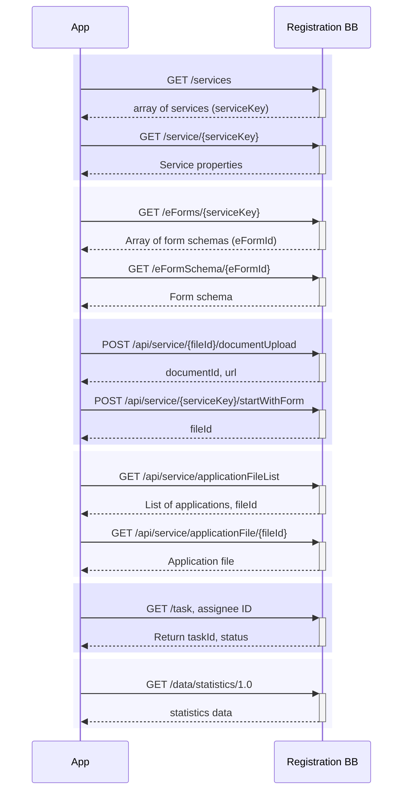

# 8 Service APIs

The APIs defined here establish a blueprint for how the Building Block will interact with other Building Blocks. Additional APIs may be implemented by the Building Block, but the listed APIs define a minimal set of functionality that should be provided by any implementation of this Building Block.&#x20;

The [GovStack non-functional requirements document](https://govstack.gitbook.io/specification/architecture-and-nonfunctional-requirements/6-onboarding) provides additional information on how 'adapters' may be used to translate an existing API to the patterns described here.

## 8.1 Accessing Services & Forms

The available services (i.e. registration processes) and form definitions within such a service can be accessed:


[https://raw.githubusercontent.com/GovStackWorkingGroup/bb-registration/main/api/GovStack_Registration_BB_API.json](https://raw.githubusercontent.com/GovStackWorkingGroup/bb-registration/main/api/GovStack_Registration_BB_API.json)



[https://raw.githubusercontent.com/GovStackWorkingGroup/bb-registration/main/api/GovStack_Registration_BB_API.json](https://raw.githubusercontent.com/GovStackWorkingGroup/bb-registration/main/api/GovStack_Registration_BB_API.json)



[https://raw.githubusercontent.com/GovStackWorkingGroup/bb-registration/main/api/GovStack_Registration_BB_API.json](https://raw.githubusercontent.com/GovStackWorkingGroup/bb-registration/main/api/GovStack_Registration_BB_API.json)



[https://raw.githubusercontent.com/GovStackWorkingGroup/bb-registration/main/api/GovStack_Registration_BB_API.json](https://raw.githubusercontent.com/GovStackWorkingGroup/bb-registration/main/api/GovStack_Registration_BB_API.json)


## 8.2 Applicant user services

Going through the registration process as an applicant requires multiple steps available via API endpoints:


[https://raw.githubusercontent.com/GovStackWorkingGroup/bb-registration/main/api/GovStack_Registration_BB_API.json](https://raw.githubusercontent.com/GovStackWorkingGroup/bb-registration/main/api/GovStack_Registration_BB_API.json)



[https://raw.githubusercontent.com/GovStackWorkingGroup/bb-registration/main/api/GovStack_Registration_BB_API.json](https://raw.githubusercontent.com/GovStackWorkingGroup/bb-registration/main/api/GovStack_Registration_BB_API.json)


Existing applications can be accessed after submission:


[https://raw.githubusercontent.com/GovStackWorkingGroup/bb-registration/main/api/GovStack_Registration_BB_API.json](https://raw.githubusercontent.com/GovStackWorkingGroup/bb-registration/main/api/GovStack_Registration_BB_API.json)



[https://raw.githubusercontent.com/GovStackWorkingGroup/bb-registration/main/api/GovStack_Registration_BB_API.json](https://raw.githubusercontent.com/GovStackWorkingGroup/bb-registration/main/api/GovStack_Registration_BB_API.json)



[https://raw.githubusercontent.com/GovStackWorkingGroup/bb-registration/main/api/GovStack_Registration_BB_API.json](https://raw.githubusercontent.com/GovStackWorkingGroup/bb-registration/main/api/GovStack_Registration_BB_API.json)



[https://raw.githubusercontent.com/GovStackWorkingGroup/bb-registration/main/api/GovStack_Registration_BB_API.json](https://raw.githubusercontent.com/GovStackWorkingGroup/bb-registration/main/api/GovStack_Registration_BB_API.json)


## 8.3 Operator user services

Operators can access and process existing application files


[https://raw.githubusercontent.com/GovStackWorkingGroup/bb-registration/main/api/GovStack_Registration_BB_API.json](https://raw.githubusercontent.com/GovStackWorkingGroup/bb-registration/main/api/GovStack_Registration_BB_API.json)



[https://raw.githubusercontent.com/GovStackWorkingGroup/bb-registration/main/api/GovStack_Registration_BB_API.json](https://raw.githubusercontent.com/GovStackWorkingGroup/bb-registration/main/api/GovStack_Registration_BB_API.json)



[https://raw.githubusercontent.com/GovStackWorkingGroup/bb-registration/main/api/GovStack_Registration_BB_API.json](https://raw.githubusercontent.com/GovStackWorkingGroup/bb-registration/main/api/GovStack_Registration_BB_API.json)



[https://raw.githubusercontent.com/GovStackWorkingGroup/bb-registration/main/api/GovStack_Registration_BB_API.json](https://raw.githubusercontent.com/GovStackWorkingGroup/bb-registration/main/api/GovStack_Registration_BB_API.json)



[https://raw.githubusercontent.com/GovStackWorkingGroup/bb-registration/main/api/GovStack_Registration_BB_API.json](https://raw.githubusercontent.com/GovStackWorkingGroup/bb-registration/main/api/GovStack_Registration_BB_API.json)



[https://raw.githubusercontent.com/GovStackWorkingGroup/bb-registration/main/api/GovStack_Registration_BB_API.json](https://raw.githubusercontent.com/GovStackWorkingGroup/bb-registration/main/api/GovStack_Registration_BB_API.json)



[https://raw.githubusercontent.com/GovStackWorkingGroup/bb-registration/main/api/GovStack_Registration_BB_API.json](https://raw.githubusercontent.com/GovStackWorkingGroup/bb-registration/main/api/GovStack_Registration_BB_API.json)


## 8.4 Statistics

The statistics API gives Building Block operational statistics, that reference the number of processed applications (per operator, registration, service, date):


[https://raw.githubusercontent.com/GovStackWorkingGroup/bb-registration/main/api/GovStack_Registration_BB_API_statistics.json](https://raw.githubusercontent.com/GovStackWorkingGroup/bb-registration/main/api/GovStack_Registration_BB_API_statistics.json)

