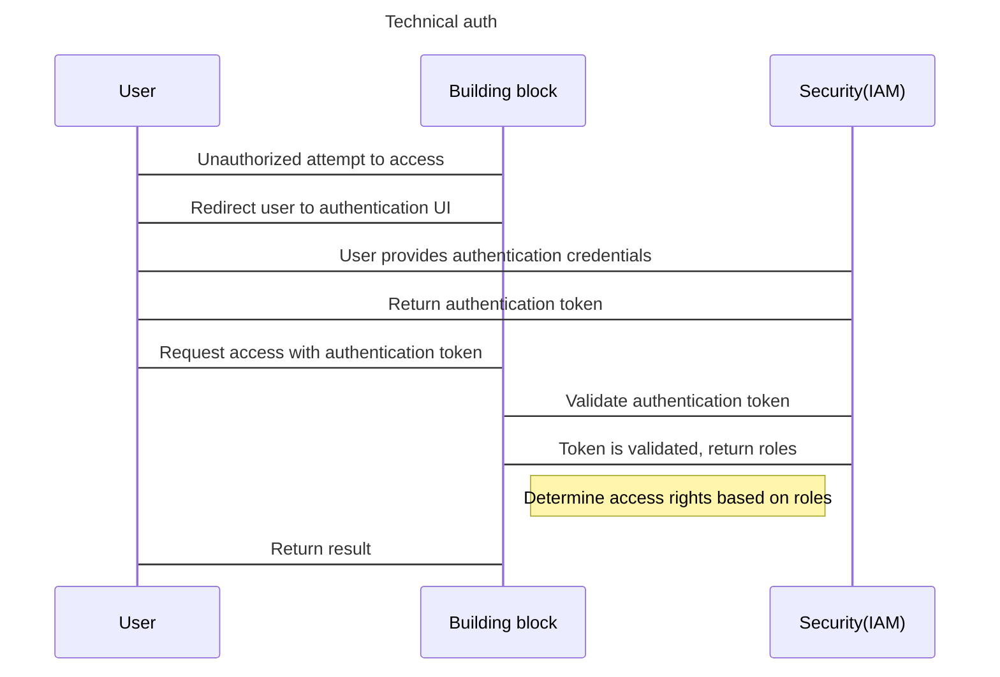
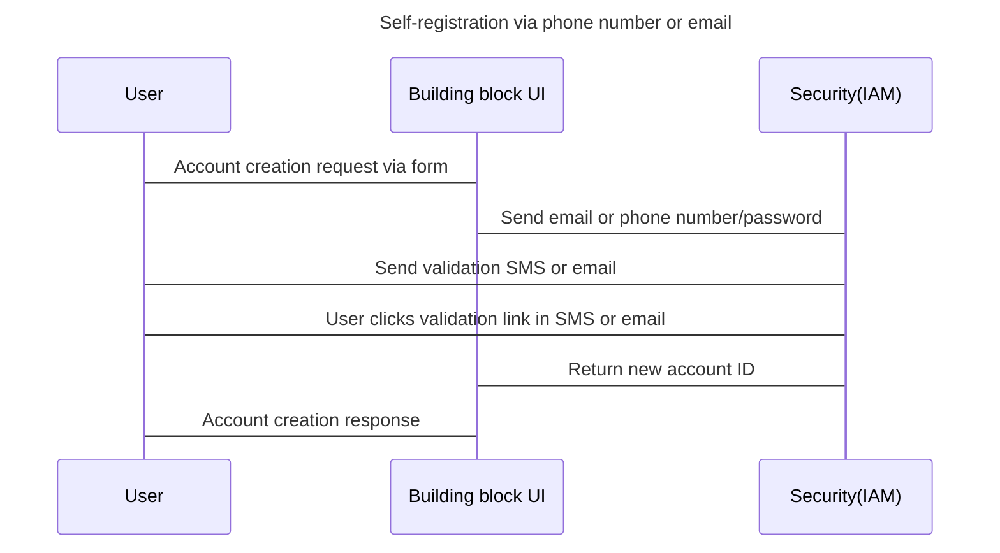
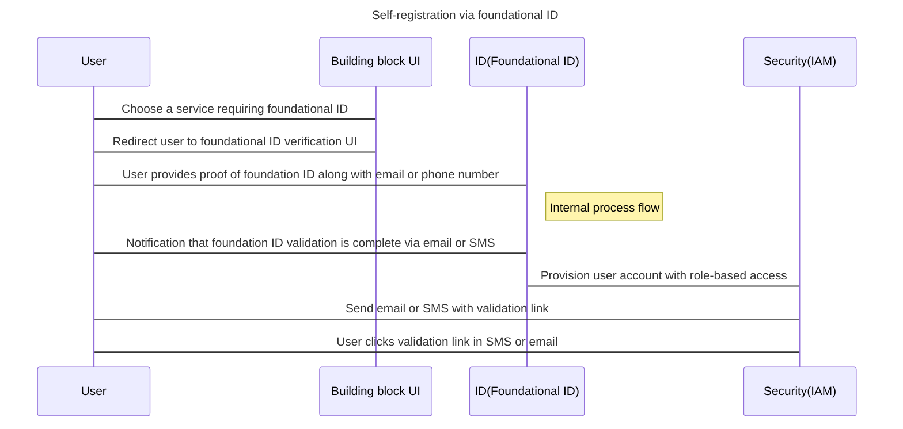
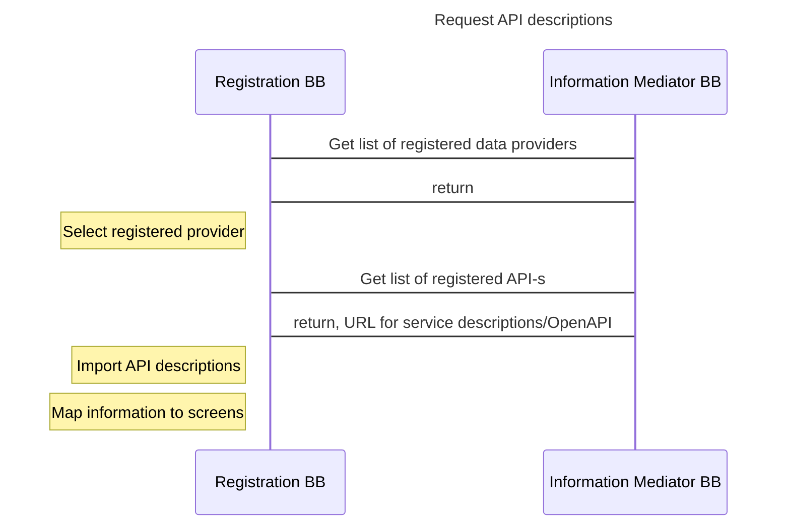
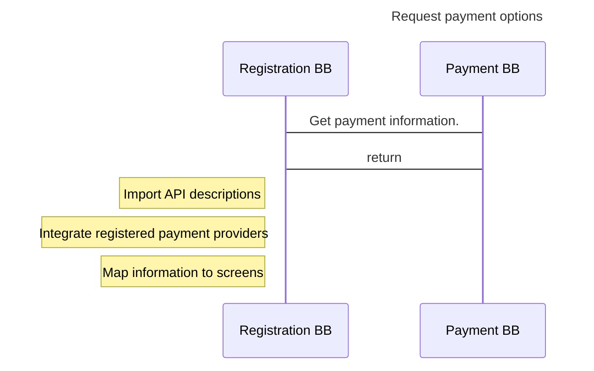
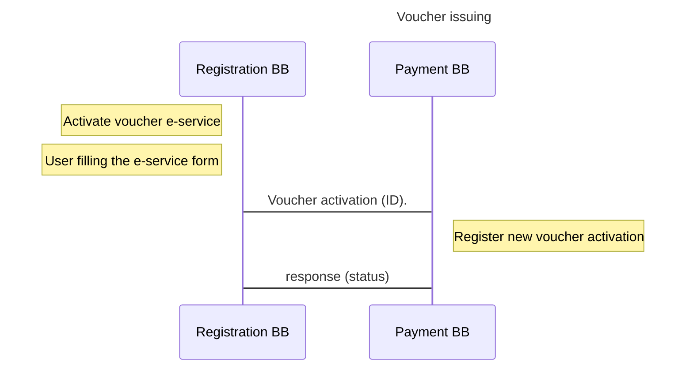

# 9 Internal Workflows

This workflow section provides a detailed view of how this Building Block will interact with other Building Blocks to support common use cases. It lists workflows that this Building Block must support. Other workflows may be implemented in addition to those listed.

In this section two main workflows are described:

* Creating a registration service.
* Using a registration service.

For each workflow interaction, a sub-section is added.

## 9.1 Workflow- Creating a Registration Service (Admin Function)

### 9.1.1 Description

The analyst/administrator as the main actor in this workflow will create a new e-service by filling in the required registration requirements, creating screens for the user, and publishing the service on the web ready to be used by internet users.

As a pre-condition, the user/analyst has authentication credentials and authorization to the service builder- rules engine. If the service needs to read or write data from external sources (Information Mediator) that require authorization then this is already authorized for the Registration Building Block. Registration Building Block is connected to Information Mediator.

As a post-condition, the e-Service is published on the internet for users to use immediately. The optimal time for an Analyst to build the e-service of a simple registration service is 2h.

### 9.1.2 User Journey 

User journey is the step-by-step journey that a user takes to reach their goal. This journey consists of a number of website pages/screens and decision points that carry the user from one step to another. The user journey is used to map out the current journey a typical user might take to reach their goal.

.png>)

### 9.1.3 Interaction with Other Building Blocks 

This workflow requires interaction with the following Building Blocks:

* Authentication and authorization (Security Building Block);
* User registration (Security Building Block);
* Information Mediator Building Block;
* Payment Building Block;
* Setup for multiple Registration Building Blocks.

For each interaction, the following information is provided:

* Name;
* Sequence diagram;
* Notes;
* Data structures (link to data resources defined above).

**Interaction 1: Authentication and Authorization (Security Building Block)**

**Name**: Authentication - Existing user authentication (Security Building Block).

Illustration 7 - Authentication and authorization.

**Notes:**\
Pre-requirements: user has passed the provisioning of user credentials and this can authenticate/login to GovStack (sandbox) system. User roles are also added by an Identity and Access Management (IAM) Security system when the token is sent to the Building Block. Registration Building Block in this case is operating as Building Block.\
See the full description of the user authentication in the [Security Building Block documentation](https://govstack.gitbook.io/specification/security-requirements/5-cross-cutting-requirements#docs-internal-guid-95b38c92-7fff-abfc-b395-b64d56ed6c74).

Data structures:

| **Name**                                | **Required Data**                                                                                                 | **Notes**                                                                                                                                                                                                                   |
| --------------------------------------- | ----------------------------------------------------------------------------------------------------------------- | --------------------------------------------------------------------------------------------------------------------------------------------------------------------------------------------------------------------------- |
| 
 Existing user authentication
 | 
 Credentials: username/e-mail/ UID,

Password,

URL of client system
                          | 
 User credentials vary depending on the country. Some countries may have additional user credentials, for example User ID number.  

Precondition- user is registered in the GovStack sandbox.  
 |
| 
 Authorization
                | 
 Roles

Example: “Service A”; “Registration Role A”; “Institution A”; “Part A”; “Part B”; “SADMIN”
 | 
 Identity and Access Management (IAM) integration.  

Precondition- user is registered in the GovStack sandbox (IAM)
                                                                                   |

**Interaction 2: User Registration (Security Building Block)**

**Name**: User first-time registration (Security Building Block)

**Sequence Diagram via Self-Registration**:

Illustration 8- Self registration

**Notes**:

Pre-requirements: user does not have user credentials to authenticate/login to GovStack (sandbox) system.\
Registration Building Block in this case is operating as a Building Block user interface.\
See the full description of the User registration in [Security Building Block documentation](https://govstack.gitbook.io/specification/security-requirements).

**Sequence Diagram for User Self Registration via Foundational ID:**

Illustration 9: Self-registration via foundational ID.

**Notes**:\
Pre-requirements: user does not have user credentials to authenticate/login to Govstack (sandbox) system. Registration Building Block in this case is operating as Building Block UI. See the full description of the User registration in the [Security Building Block documentation](https://govstack.gitbook.io/specification/security-requirements/5-cross-cutting-requirements#docs-internal-guid-95b38c92-7fff-abfc-b395-b64d56ed6c74).

**Interaction 3: Information Mediator Building Block**

**Name**: Request API descriptions (Information Mediator Building Block)

Illustration 10- Information Mediator API description.

**Data structures:**

| **Name**                                                 | **Returned Data**                                                                                 | **Notes**                                                                                                                                                                                                                                                                                                             |
| -------------------------------------------------------- | ------------------------------------------------------------------------------------------------- | --------------------------------------------------------------------------------------------------------------------------------------------------------------------------------------------------------------------------------------------------------------------------------------------------------------------- |
| 
 Get list of registered institutions/databases
 | 
 Return: List of data providers (institution name, system name, ID)
                     | 
 The returned list (institution ID, system name) will be given as an input to the next call to see the list of APIs  
                                                                                                                                                                                 |
| 
 Request API descriptions
                      | 
 Datasource name, ID, URL of the service and url for the service descriptions (swagger)
 | 
 Pre requirements:

· Subscription for Registration Building Block to use the Information Mediator system is done.

· Before the Registration Building Block can use API information for screen populating with data the system must import API service descriptions  
                      |
| 
 Get service descriptions
                      | 
 Input: URL of the OAPI service.

Output: OAPI descriptions
                        | 
 It works like Swagger. This endpoint may be external.

 

Example API services to integrate to Registration Building Block screens:
<ol><li>Registry Building Block - Register of Mother and Child Program</li><li>Payment Building Block API to read received payments data  </li></ol> |

**Interaction 4: Payment Building Block**

**Name**: Get list of payment options (Payments Building Block)

**Sequence diagram:**

Illustration 11- Request payment options.

**Data structures:**

| **Name**                               | **Response**                                                                           | **Notes**                                                                                                                                              |
| -------------------------------------- | -------------------------------------------------------------------------------------- | ------------------------------------------------------------------------------------------------------------------------------------------------------ |
| 
 Get list of payment options
 | 
 Payment API descriptions,

List of payment options, details, data, url
 | 
 Before the Registration BB can use the Payment BB information for screen populating the system must import API service descriptions  
 |

**Interaction 5: Setup for Multiple Registration BBs**

**Name**: Setup for multiple Registration Building Blocks

**Description :**\
The Registration Building Block can be set up as a standalone Building Block facilitating multiple institutions and services in one system instance (See illustration 1 below).\
Setup in one shared instance is required when one single window service is built together with multiple institutions (multiple registrations inside one service). This enables sharing of resources such as Process Flow Diagrams, screens, data, user rights, infrastructure, maintenance personnel, etc.

In other cases, the Registration Building Blocks can be installed in different instances (domain-specific instances- see illustration 2 below), and in this case, the Building Blocks are not sharing resources and are not communicating with the other Registration Building Blocks. In these standalone instances, the Building Blocks are communicating with Information Mediator Building Block and other Building Blocks.

## 9.2 Workflow- Using a Registration Service 

### 9.2.1 Description 

The citizen/applicant, as the main actor in the process, will open a web URL address and authenticate. Once authenticated, the applicant opens an e-service and fills in the required data fields /claims on the first screen. The system/rule engine will then validate if the user is applicable for any registrations and if so will open a list of mandatory or optional registrations for the user to select. Once selected the system will fill the form with the required data fields relevant for the applicant to fill. In addition, the system will show which documents are relevant for the applicant to upload and how much fees to pay. An applicant will then fill in data, upload documents, select a payment method, and make the payment (if required). If designed so the Control Configurator component will validate captured data against external API data and in case validation fails issue warnings to the applicant. After payment, the applicant can submit the application file for registration and processing. The system validates if all required fields are correctly filled in upon submission.

The back office system registers all applications submitted. If configured so, the process flow may have bot(s) and human(s) in the flow. Bot roles process applications by validating information against external API information. When processed the BOT role will pass the processing task to the next role.

The back office operator as the main actor in the second part of the process receives a task notification message and authenticates to the web system. The system shows a list of applications assigned for the operator to process. The operator will then open the application and verify the application content and make a decision (approve, reject, or send back for correction). If an application has discrepancies then the operator will mark the errors and/or explain the reasons for rejections. When the application file is positively processed by the back office operators, then the applicant will receive the credential/result of the application. If the back office processing flow has multiple roles then the approval by the first processing role operator will take the application processing task to the next role.

**Preconditions**:\
As a pre-condition, the web system is accessible from the internet, and the service is published, the user/applicant has user credentials for authentication. No authorization is needed for applicants if the service is usable by all users.\
The user/operator has authentication credentials and authorization to the web portal/back office system and to a service, if not open to all users. If a service needs to read or write data from an external source (Information Mediator-API) that requires authorization then this is already authorized for the Registration Building Block.\
As a postcondition, the applicant was able to fill out a registration form and submit an application. As an operator, the user was able to see the pending applications and process the applications.

**Sequence Diagram:**

.png>)

### **9**.2.2 Interaction with other Building Blocks 

This workflow requires interaction with the following Building Blocks:

* Authentication and authorization (Security Building Block) - see “Creating a registration service”;
* Information Mediator Building Block;
* Payment Building Block;
* Digital Registries Building Block.

For each interaction, the following information is provided:

* Name;
* Sequence diagram;
* Data structures (link to data resources defined above);
* Notes.

**Interaction 1: Voucher Pre-Activation (Payment Building Block)**

**Name**: Voucher pre-activation (Payment Building Block)

Use case: e-service user initiates a registration service to issue a payment voucher for the subject/beneficiary.\
**Pre-conditions**: The subject is identified and information is verified. The user has credentials to authenticate in the Registration Building Block web interface. User has authorization to use the Voucher activation registration e-service. User has pre-activated vouchers printed on the paper. All communication is securely done via Information Mediator Building Block.\
**Post-conditions**: A subject/ beneficiary will receive an activated payment voucher and the voucher is activated in the respective external registry.

Illustration 13 - Voucher issuing diagram.

**Data structures**:

| **Name**           | **Required Data** | **Notes**                                                                                                                              |
| ------------------ | ----------------- | -------------------------------------------------------------------------------------------------------------------------------------- |
| Voucher activation | Voucher ID        | 
See more in <a href="https://govstack.gitbook.io/specification/building-blocks/payments">Payments Building Block</a>

 
 |
| Response           | Status            | The response is stored in Registration Building Block                                                                                  |
